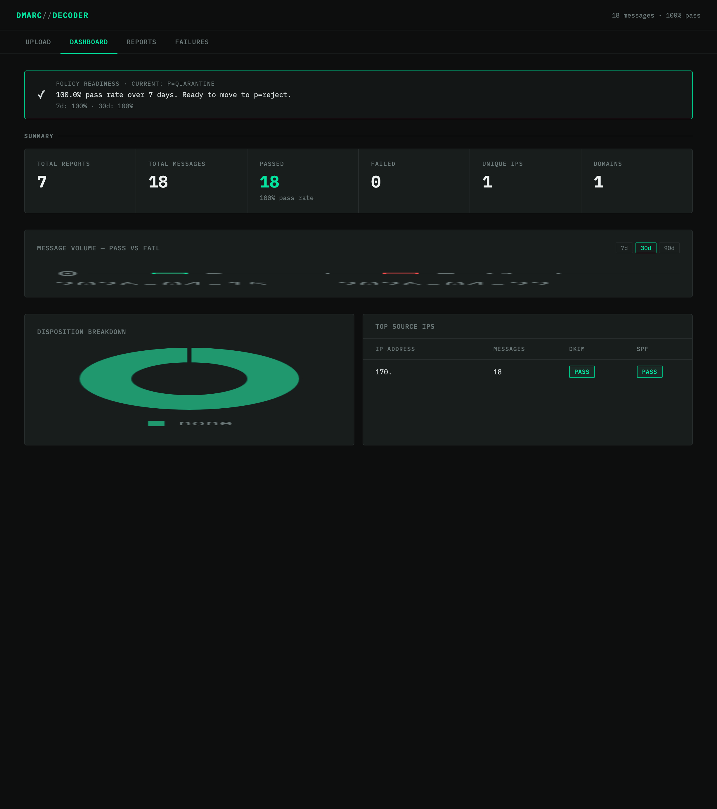
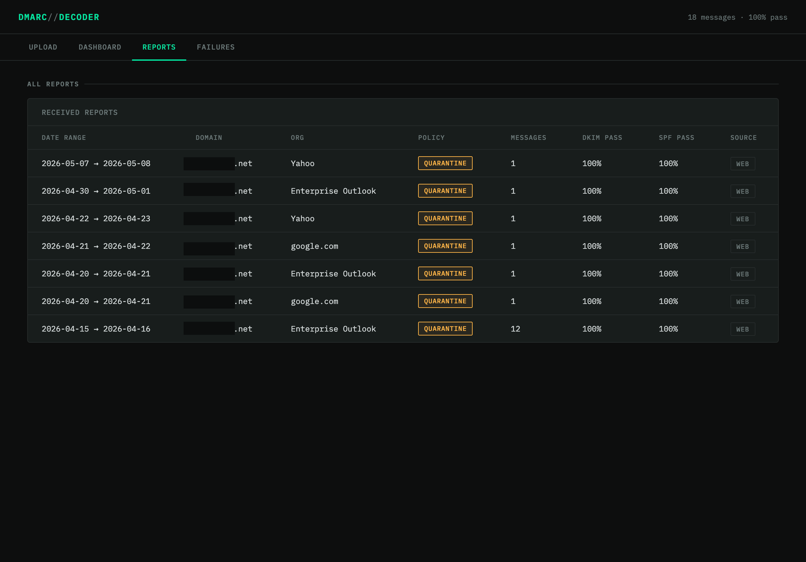
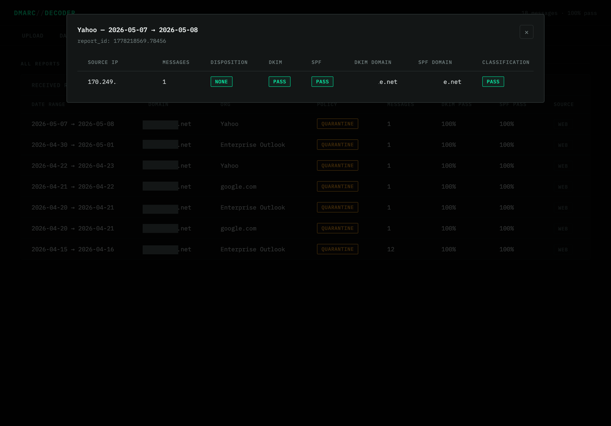
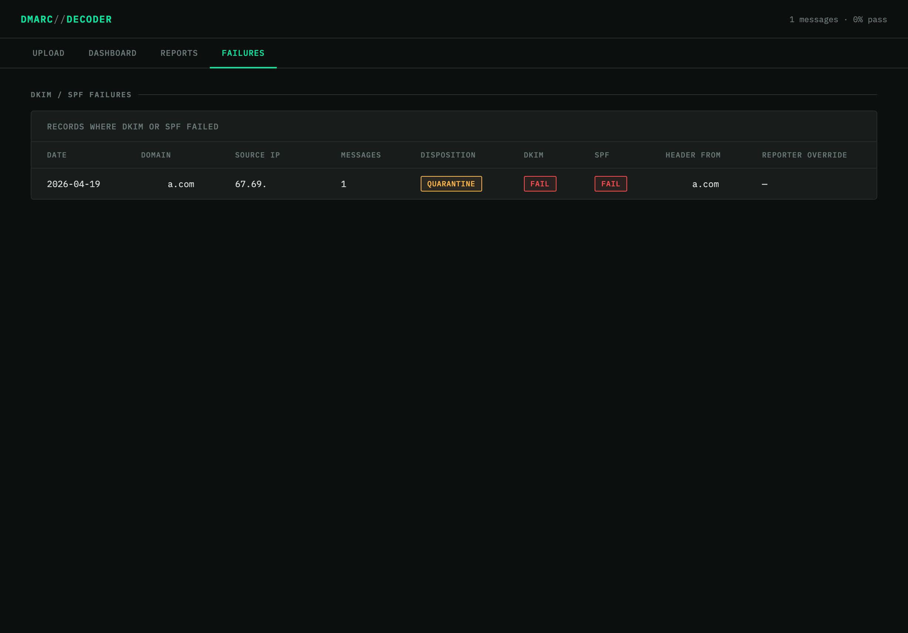
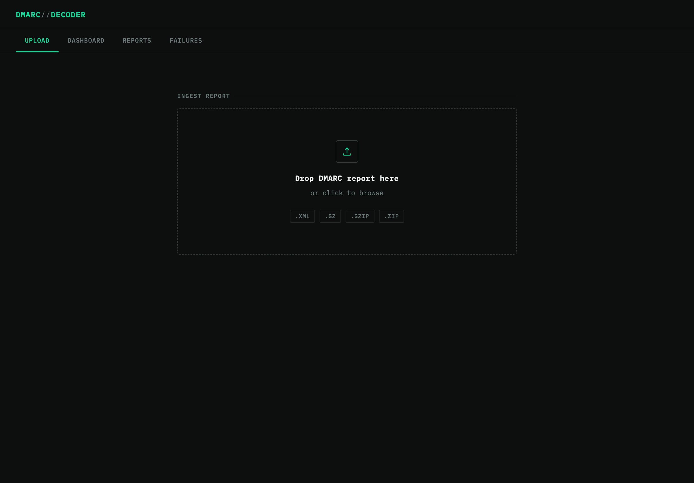

# DMARC Decoder

A self-hosted DMARC aggregate report parser and dashboard, deployable to your own AWS account with a single command.

DMARC aggregate reports arrive as XML (often compressed inside ZIP or GZIP) and are tedious to read raw. This tool ingests them, parses them, stores them in a relational database, and presents a clean reporting dashboard so you can see at a glance how your domain's email is being handled across the internet.

---

## Screenshots

<a href="docs/screenshots/dmarc-decoder-dashboard.png"></a>
<a href="docs/screenshots/dmarc-decoder-reports.png"></a>
<a href="docs/screenshots/dmarc-decoder-report-detail.png"></a>
<a href="docs/screenshots/dmarc-decoder-failures.png"></a>
<a href="docs/screenshots/dmarc-decoder-landing-page.png"></a>

---

## Intention

I created this tool to help monitor changes to mail delivery while working through various DMARC, DKIM and SPF configurations.  Use it for a week or two and destroy it, or keep it around as long as it's useful.

This project is designed to be private, self-hosted, and cost-effectively near-zero to run. It is not a SaaS product — it is a fully open infrastructure definition you clone, configure with your own AWS credentials, and deploy into your own account. No data leaves your AWS environment.

The full stack is defined in Terraform and can be created or destroyed with a single script. Raw reports land in S3 as the permanent source of truth. The database can be rebuilt from those files at any time.

---

## Architecture

```
Ingestion Path 1 — Web Upload
  Browser
    → GET /upload-url  (API Gateway → presigned_url Lambda)
    → PUT file directly to S3 raw/web/YYYY/MM/DD/

Ingestion Path 2 — Email (future — see Activating Email Ingestion)
  Inbound email → SES → ses_handler Lambda
    → S3 raw/email/YYYY/MM/DD/

Both paths converge →
  S3 raw/ prefix
    → S3 ObjectCreated event
    → parser Lambda
    → Aurora Serverless v2 (PostgreSQL, Data API)

Frontend reporting →
  Browser
    → GET /query/{report_type}  (API Gateway → query_handler Lambda)
    → Aurora Serverless v2
    → JSON → Dashboard
```

### Components

| Component | Purpose |
|---|---|
| S3 bucket | Single entry point — raw reports and static frontend |
| API Gateway (REST v1) | Two routes: presigned URL generator and reporting queries |
| Lambda — parser | S3-triggered; decompresses XML/ZIP/GZIP, writes to Aurora |
| Lambda — ses_handler | Extracts DMARC attachment from inbound email, drops to S3 (stubbed) |
| Lambda — presigned_url | Generates short-lived S3 upload URLs for the browser |
| Lambda — query_handler | Serves reporting SQL queries from the frontend dashboard |
| Aurora Serverless v2 | PostgreSQL database; scales to zero when idle |
| Secrets Manager | Stores Aurora credentials; auto-generated and destroyed with the stack |
| CloudWatch Logs | 30-day log retention for all Lambda functions |

### API Routes

| Method | Path | Purpose |
|---|---|---|
| GET | /upload-url | Returns presigned S3 PUT URL for browser upload |
| GET | /query/summary | Overall pass/fail totals |
| GET | /query/top-ips | Top sending IPs by message volume |
| GET | /query/trend | Daily pass/fail trend (supports ?days=7\|30\|90) |
| GET | /query/disposition | Breakdown by disposition (none/quarantine/reject) |
| GET | /query/failure-detail | Records where DKIM or SPF failed |
| GET | /query/reports | Full list of received reports |

### Database Schema

| Object | Type | Purpose |
|---|---|---|
| `reports` | Table | One row per aggregate report (metadata, policy, date range) |
| `records` | Table | One row per source IP per report (results, counts, disposition) |
| `v_dmarc_summary` | View | Joins reports + records for convenient querying |

---

## Cost

Unless you are processing an extraordinarily large volume of DMARC reports, your only real expense is the Secrets Manager secret at **$0.40/month**. Everything else — S3, Lambda, API Gateway, Aurora, CloudWatch — either falls within AWS free tier or scales to zero when idle.

Aurora cold-starts in 20–40 seconds after a period of inactivity. The dashboard handles this gracefully with a retry prompt. If the latency bothers you, you could add a keep-alive using an EventBridge scheduled rule to ping the database every few minutes.

---

## Prerequisites

- **AWS account** with permissions to create S3, Lambda, API Gateway, RDS (Aurora), Secrets Manager, IAM, and CloudWatch resources. If using an IAM user rather than root, `AdministratorAccess` is the simplest option.
- **AWS CLI** installed and configured (`aws configure`) with credentials for your account.
- **Terraform >= 1.5.0** installed.
- **Your public IP address** — the API Gateway allowlist requires it. Get it with `curl https://checkip.amazonaws.com`.
- **A unique S3 bucket name** — S3 names are global across all AWS accounts. Something like `dmarc-decoder-yourname` or `dmarc-decoder-yourdomain` works well.

---

## Deployment — One Shot

Clone the repo, configure your variables, and run one script. That is all.

### Step 1 — Clone the repository

```bash
git clone https://github.com/your-username/dmarc-decoder.git
cd dmarc-decoder
```

### Step 2 — Create your variables file

```bash
cp infrastructure/terraform.tfvars.example infrastructure/terraform.tfvars
```

Edit `infrastructure/terraform.tfvars`:

```hcl
# Your AWS region
aws_region = "us-east-1"

# Prefix for all AWS resource names
project_name = "dmarc-decoder"

# Must be globally unique across all of AWS
s3_bucket_name = "dmarc-decoder-yourname"

# Your public IP — from: curl https://checkip.amazonaws.com
# Add multiple IPs if deploying from more than one location
allowed_ips = ["YOUR.PUBLIC.IP.HERE/32"]

# Protect S3 data from accidental deletion (recommended: keep false)
s3_force_destroy = false
```

`terraform.tfvars` is gitignored and will never be committed.

### Step 3 — Make scripts executable

```bash
chmod +x scripts/deploy.sh scripts/destroy.sh
```

### Step 4 — Deploy

```bash
./scripts/deploy.sh
```

The script will:

1. Run `terraform init` and `terraform apply` — provisions all AWS infrastructure
2. Extract Terraform outputs (Aurora ARN, API URL, S3 bucket name)
3. Wait for Aurora to become ready, then initialize the database schema
4. Write `frontend/config.js` with your live API Gateway URL
5. Sync the frontend to S3

When complete, the script prints your frontend URL and API Gateway URL.

**Total time:** approximately 10–15 minutes. Aurora provisioning dominates — creating the RDS writer instance alone can take up to 10 minutes.

---

## Teardown

```bash
./scripts/destroy.sh
```

The script will:
- Confirm your intent (type `destroy` to proceed)
- Run `terraform destroy` — removes all AWS resources
- Delete the generated `frontend/config.js`
- Display what happened to your S3 data

**S3 data behavior on destroy:**

| `s3_force_destroy` setting | What happens to S3 |
|---|---|
| `false` (default) | Bucket is preserved if it contains data. Delete contents manually first or set to true. |
| `true` | Bucket and all raw report files are permanently deleted with no confirmation. |

To manually delete the bucket after a failed destroy:
```bash
aws s3 rb s3://YOUR-BUCKET-NAME --force
```

---

## Repository Layout

```
dmarc-decoder/
├── README.md                          — this file
├── .gitignore
├── infrastructure/
│   ├── main.tf                        — all AWS resources
│   ├── variables.tf                   — input variable definitions
│   ├── outputs.tf                     — Terraform outputs used by deploy.sh
│   ├── schema.sql                     — Aurora schema (reference; executed by deploy.sh)
│   └── terraform.tfvars.example       — safe to commit; copy to terraform.tfvars
├── lambda/
│   ├── parser/handler.py              — S3-triggered DMARC report parser
│   ├── ses_handler/handler.py         — email ingestion handler (deployed, not yet wired)
│   ├── presigned_url/handler.py       — S3 presigned URL generator
│   └── query_handler/handler.py       — reporting query handler
├── frontend/
│   ├── index.html                     — single-page dashboard application
│   ├── config.template.js             — template; deploy.sh writes the real config.js
│   └── config.js                      — gitignored; generated by deploy.sh
├── scripts/
│   ├── deploy.sh                      — one-command deploy
│   └── destroy.sh                     — one-command teardown
└── tests/
    └── fixtures/
        └── sample_report.xml          — sample DMARC aggregate report for testing
```

---

## Configuration Reference

All configuration lives in `infrastructure/terraform.tfvars` (gitignored).

| Variable | Default | Required | Description |
|---|---|---|---|
| `aws_region` | `us-east-1` | No | AWS region to deploy into |
| `project_name` | `dmarc-decoder` | No | Prefix for all AWS resource names |
| `s3_bucket_name` | `dmarc-decoder` | Yes | Must be globally unique across AWS |
| `s3_force_destroy` | `false` | No | Allow destroy to delete S3 bucket with data |
| `db_name` | `dmarcdb` | No | Aurora database name |
| `db_username` | `dmarcadmin` | No | Aurora master username |
| `allowed_ips` | (none) | Yes | List of IPs/CIDRs allowed to access the API |

---

## Security

**API access** is restricted by a native API Gateway resource policy. Requests from IPs outside `allowed_ips` receive a 403 before any Lambda is invoked — no compute cost, no bypass possible.

**S3** blocks all public access. Report files are only accessible via presigned URLs (time-limited, scoped to specific keys) or Lambda functions with IAM permissions.

**Aurora credentials** are randomly generated at deploy time (32 characters, no special characters). They are stored in Secrets Manager and never appear in Terraform state in plaintext. The secret is destroyed immediately when `terraform destroy` runs (`recovery_window_in_days = 0`).

**IAM** — all Lambda functions share a single least-privilege execution role scoped to this project's S3 bucket, Aurora cluster, and Secrets Manager secret only.

**Encryption** — S3 server-side encryption (AES-256) is enabled on all objects.

---

## Updating Your IP Address

If your public IP changes (common with home internet connections):

1. Update `allowed_ips` in `terraform.tfvars`
2. Run `./scripts/deploy.sh` — Terraform will update the API Gateway policy in place; no downtime, no data loss

---

## Future: Activating Email Ingestion

The `ses_handler` Lambda is deployed and ready. To activate automatic report ingestion via email:

**1. Verify your domain in SES**

In the AWS console → SES → Verified Identities, verify the domain you want to receive DMARC reports on. AWS will give you DNS records to add (DKIM CNAME records and an MX record pointing to the SES inbound endpoint for your region).

**2. Update your DMARC DNS record**

Add or update your domain's DMARC TXT record to include an RUA address pointing to your SES-verified address:

```
_dmarc.yourdomain.com  TXT  "v=DMARC1; p=quarantine; rua=mailto:dmarc@yourdomain.com"
```

**3. Create an SES receipt rule set**

In SES → Email receiving, create a receipt rule that:
- Matches recipient: `dmarc@yourdomain.com`
- Action 1: Store raw email to S3 (prefix `ses-raw/` in your dmarc-decoder bucket)
- Action 2: Invoke Lambda — select `dmarc-decoder-ses-handler`

**4. Set variables and redeploy**

```hcl
ses_domain        = "yourdomain.com"
ses_email_address = "dmarc@yourdomain.com"
```

```bash
./scripts/deploy.sh
```

Reports emailed to that address will now flow automatically into the parser pipeline.

---

## Future: Backup Strategy

Raw report files in S3 are the source of truth. Aurora can be fully rebuilt from them at any time. Aurora backup retention is set to 1 day (the minimum AWS allows) — backups of an empty or rebuildable database add negligible cost.

When your report history becomes valuable, consider:

- **S3 versioning** — protects against accidental deletion of raw reports. Enable by adding `versioning_configuration { status = "Enabled" }` to the S3 bucket resource in `main.tf`.
- **Aurora automated backups** — set `backup_retention_period = 7` in the `aws_rds_cluster` resource. Adds approximately $0.021/GB-month of backup storage.
- **S3 replication** — replicate raw reports to a second region for disaster recovery.

---

## Contributing

Pull requests welcome. Keep infrastructure changes Terraform-managed and avoid hardcoding account-specific values. All sensitive values belong in `terraform.tfvars`, which is gitignored.
